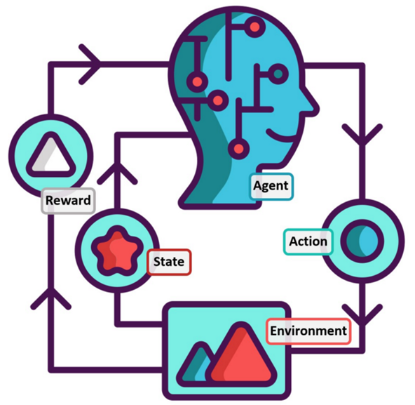

## What is Red Team 

In today's rapidly evolving security landscape, addressing the formidable Advanced Persistent Threats (APTs) has become an increasingly complex task. Enter the concept of a "Red Team" - a game-changing approach to security assessment that goes beyond traditional penetration testing.

> The terms "red team" and "penetration test" are often used interchangeably, even though they have distinct purposes and approaches.

](./figures/auto-red-team/flow_chart.png)

[https://vulnsign.com/red-teaming](https://vulnsign.com/red-teaming)

Unlike conventional penetration tests, which aim to uncover as many vulnerabilities as possible, a Red Team Assessment takes a more targeted approach. Its objective is not just to find weaknesses but to put an organization's detection and response capabilities to the ultimate test. Emulating the tactics of a real-world attacker, the Red Team endeavors to gain access to sensitive information by any means necessary.

To accurately replicate the tactics employed by adversaries, Red Team operations follow a sequential decision-making process, much like a well-planned campaign. Adversaries systematically progress through different stages, building upon each success to achieve their objectives. To ensure a comprehensive replication of these techniques, Red Team practices should adopt a sequential approach aligned with the attacker's methodology, leveraging the **MITRE Att&CK** framework. When applied to penetration testing, this structured and systematic approach enables testers to navigate their engagements with precision.

While the efficacy of Red Teaming or Penetration testing is undeniable, the human effort and cost involved can present significant challenges. Thankfully, the solution lies in the integration of intelligent automation. By harnessing the power of automated tools and technologies, organizations can streamline and augment their security assessments, empowering their teams to focus on strategic decision-making and stay one step ahead of potential threats.

[https://github.com/infosecn1nja/AD-Attack-Defense](https://github.com/infosecn1nja/AD-Attack-Defense)

## Why planning may not work

Planning is generally considered a good and straightforward approach. It helps us set goals, make schedules, and organize our actions to achieve desired outcomes. However, life is full of surprises, and sometimes unexpected events occur that can throw a wrench in our carefully laid plans. For instance, imagine you have diligently scheduled a date, but due to unforeseen circumstances like having to work overtime, you end up missing it.

In such situations, it becomes necessary to have backup plans in place. These backup plans, often referred to as plan B, plan C, and so on, act as alternative strategies that can be implemented when our initial plans go awry. They serve as contingency measures to help us navigate through unexpected disruptions.

The effectiveness of these backup plans depends on our ability to anticipate and understand what might happen in different scenarios—a concept known as having a "world model" or a comprehensive awareness of our surroundings. This world model allows us to predict possible obstacles or challenges that might arise and develop backup plans accordingly. However, relying solely on a rigid and static world model has its limitations.

The process of identifying potential incidents and generating backup plans is a complex task that requires substantial human effort. It becomes even more challenging when faced with situations that go beyond the known incidents we have prepared for. Unexpected events that we couldn't have anticipated can occur simultaneously or deviate from our expectations, making it difficult to respond effectively.

This is where the concept of a dynamic policy comes into play. A dynamic policy is flexible and adaptable, capable of adjusting to changing circumstances. It doesn't rely solely on predefined plans but rather learns from experience and interacts with its environment to make informed decisions. One effective approach to developing such dynamic policies is through reinforcement learning.
## Concept of Reinforcement Learning 
Reinforcement learning is a machine learning technique that allows an agent to learn and improve its decision-making process through trial and error. It learns by receiving feedback or rewards based on its actions and adjusts its behavior accordingly. This approach enables the agent to learn a policy—a set of rules or guidelines—that can adapt to unexpected situations and perform at a level comparable to human performance.

Projects like AlphaStar and OpenAI Five have demonstrated the power of reinforcement learning in creating dynamic and adaptable policies. For example, AlphaStar, developed by DeepMind, achieved remarkable success in playing the game StarCraft II at a professional level. OpenAI Five, on the other hand, showcased impressive teamwork and coordination in the game Dota 2. These projects highlight how reinforcement learning can enable AI systems to navigate complex and dynamic environments, making decisions that rival human capabilities.

By leveraging reinforcement learning to develop dynamic policies, we can enhance our ability to respond effectively to unexpected events. These policies can adapt and adjust to changing circumstances, offering us a more robust and reliable approach to handling disruptions and achieving desired outcomes.

## The Goal/Objectives of this work

The goal of this project is to bring efficient learning-based control methods to real robots. A promising direction to learning from a few trials is to separate the task. First, train a model of the interactions with the environment and then use model-based reinforcement learning or model-based planning to control the robot.